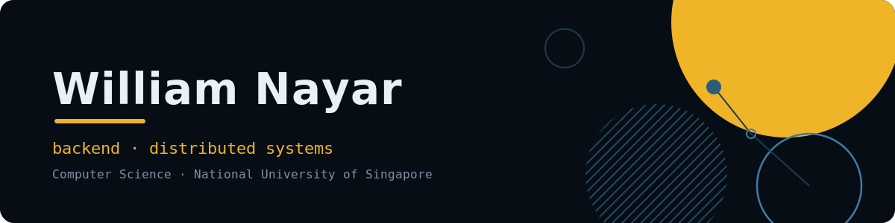

  

  
  

Final-year CS at NUS specialising in Software Engineering. I build backend systems and care about where work belongs in a system. 
Looking for a 6-month SWE internship starting early 2027.

---

## Currently

- Building **Recall**, a search engine in Go, to understand indexing and retrieval by building them rather than reading about them
- Next: a real-time collaboration platform on TypeScript, Postgres and Redis

---

## Achievements

- **1st place, Daytona HackSprint** by AI Builders at NUS (July 2026), for **Airlock** (below)
- **Certificate of Distinction**, Software Engineering focus area, NUS School of Computing
- **Merged open source PRs** in [Automattic/mongoose](https://github.com/Automattic/mongoose) and [redis/node-redis](https://github.com/redis/node-redis), gaps I found by reading the source rather than working off issue labels

---

## Selected Work

### [Airlock](https://github.com/Wnayar/airlock) &nbsp;🏆 1st Place

1st place at the Daytona HackSprint. A safety gate that sits between an AI coding agent and every package it tries to install.

- Each install is detonated in an isolated sandbox before it touches the system, then read statically, matched against known malware, and reputation scored, with an LLM issuing the final verdict
- Enforced as a hook rather than a wrapper, so the agent cannot route around it
- Weekend team build; the concept and system design were mine

*Sponsors:* &nbsp;`Daytona` `Nosana` `Doubleword` `Oxylabs` `ai&`

### [Aqua Vitae](https://github.com/Wnayar/aqua-vitae) &nbsp;

Own venture. Sole engineer for a fragrance brand launching Dec 2026: storefront, backend and infrastructure.

- Backend on Supabase (PostgreSQL) and Vercel Functions: authentication, relational schema design, and caching
- React and TypeScript storefront with a Shopify hosted checkout, keeping payments and PCI scope off my stack
- CI/CD through Vercel, Cloudflare DNS and GitHub automation, with analytics supporting early testing across 100+ visitors

*Built with:* &nbsp;`TypeScript` `React` `PostgreSQL` `Supabase` `Vercel` `Cloudflare` `Shopify`

### [PeerPrep](https://github.com/Wnayar/PeerPrep) &nbsp;Distributed · 6 Services

Question Service owned end to end within a distributed 6-service architecture.

- 15 RESTful endpoints with input validation and standardized error handling (400/404/409/500)
- Moved randomized question selection into MongoDB aggregation pipelines ($match, $sample) instead of the application layer
- 35 unit and integration tests with Jest and Supertest covering CRUD workflows and the pipelines

*Built with:* &nbsp;`Node.js` `Express` `TypeScript` `MongoDB` `Mongoose` `Jest` `Supertest`

### [Study-group platform](https://github.com/Wnayar/NUS-GroupMatch) &nbsp;NUS Orbital · Apollo 11

NUS Orbital, Apollo 11 Advanced. Full-stack MERN app for creating and discovering study groups, matched on live NUSMods course data.

- REST APIs with session-based auth (express-session, bcrypt) and MVC structure, with MongoDB schemas for users, groups and memberships
- Parsed nested timetable data (20 to 50+ entries per module) into structured formats with multi-criteria sorting and search

*Built with:* &nbsp;`MongoDB` `Express` `React` `Node.js`

---

## Technical Skills

| Category | Stack |
|---|---|
| **Languages** |         |
| **Backend** |    |
| **Data** |       |
| **Infra & Cloud** |         |
| **Frontend** |     |
| **Tools** |     |
