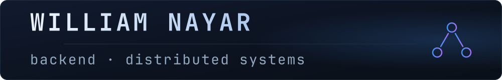

  

  <b><a href="https://williamnayar.com/">Website</a></b>
  &nbsp;·&nbsp;
  <b><a href="https://williamnayar.com/resume">Resume</a></b>
  &nbsp;·&nbsp;
  <b><a href="https://www.linkedin.com/in/william-nayar/">LinkedIn</a></b>
  &nbsp;·&nbsp;
  <b><a href="mailto:wnayar98@gmail.com">Email</a></b>

Software engineer and founder, leading student engineering teams at NUS, building at scale and drawn to hard problems. 
Final-year Computer Science at NUS specialising in Software Engineering, graduating May 2027.

---

### <picture><source media="(prefers-color-scheme: dark)" srcset="assets/glyph-currently-ink-dark.svg"></picture> Currently

- Teaching **[CS3219 Software Design & Architecture](https://nusmods.com/courses/CS3219/software-engineering-principles-and-patterns)** at NUS, mentoring 11 student engineering teams
- Building **[DeepCS](https://deepcs.org)**, a learning platform for CS interview preparation, as founder and sole engineer

---

### <picture><source media="(prefers-color-scheme: dark)" srcset="assets/glyph-work-ink-dark.svg"></picture> Experience

### NUS · Teaching Assistant, Software Design & Architecture (CS3219)

**Aug 2026 – Present**

- Mentor 11 student engineering teams through the full software development lifecycle, guiding the design, build, testing, and deployment of distributed microservices applications with REST APIs, Docker, and CI/CD
- Lead weekly classes of 30 students on large-scale system design, architecture trade-offs, and maintainable engineering practices
- Iterate on course materials weekly with professors, turning student feedback and recurring misconceptions into improved tutorials

### [DeepCS](https://github.com/Wnayar/deepcs) · Founder & Software Engineer · [deepcs.org](https://deepcs.org)

**Jul 2026 – Present**

- Deployed and maintain a full-stack learning platform on Cloudflare Workers and D1, serving the React app and all content from the edge at $0 idle cost
- Re-architected a 6-service microservices backend (Docker, Redis, WebSockets, PostgreSQL) into a single edge Worker after user feedback showed no demand for live collaboration
- Secured the API with Firebase JWT verification, a server-side paywall gate, and per-user rate limiting, with no route ever trusting a user id sent by the client
- Built payments on Stripe with signature-verified, idempotent webhooks, keeping Stripe's ledger as the source of truth so user access can be rebuilt after any data loss
- Wrote a test suite containing unit, integration, and end-to-end tests running in CI on every push, to catch regressions and ensure high code quality

### [Mongoose](https://github.com/Automattic/mongoose) & [node-redis](https://github.com/redis/node-redis) · Software Engineer, Open Source

**Jun 2026 – Jul 2026**

- Improved official documentation for Mongoose (27K+ GitHub stars) and node-redis (17K+ stars), database libraries used by millions of developers, with 3 pull requests reviewed and merged by maintainers
- Found the gaps while using the libraries in production work: documented an undocumented query option in Mongoose, and traced node-redis source code to correct docs referencing a deprecated API

### [Aqua Vitae Parfums](https://github.com/Wnayar/aqua-vitae) · Founder & Software Engineer · [aquavitaeparfums.com](https://www.aquavitaeparfums.com/)

**Dec 2025 – Mar 2026**

- Founded and launched a perfume business (brand, product) as the sole engineer, designer, and operator
- Built a custom React + TypeScript storefront with reusable components and centralized state, integrating Shopify for checkout to keep payments and compliance off my plate
- Owned every deadline and deliverable, following through from first commit to a live storefront with paying customers

---

### <picture><source media="(prefers-color-scheme: dark)" srcset="assets/glyph-achievements-check-dark.svg"></picture> Awards & Certificates

- **NUS Certificate of Distinction, Software Engineering:** 4.50 GPA across key Software Engineering modules
- **Hackathon Overall Winner:** 1st Place, AI Builder and Daytona HackSprint 2026

---

### <picture><source media="(prefers-color-scheme: dark)" srcset="assets/glyph-skills-ink-dark.svg"></picture> Technical Skills

**Languages**  
  
*Also:* &nbsp;`SQL`

**Frontend**  

**Backend & Systems**  
  
*Also:* &nbsp;`REST APIs` `WebSockets` `Distributed Systems` `TCP/IP` `HTTP`

**Databases**  

**Cloud & Tools**  
  
*Also:* &nbsp;`CI/CD` `Vitest`
